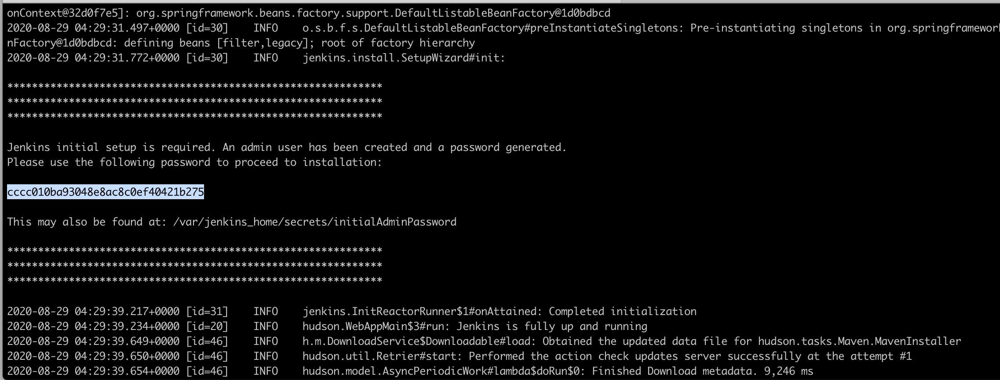
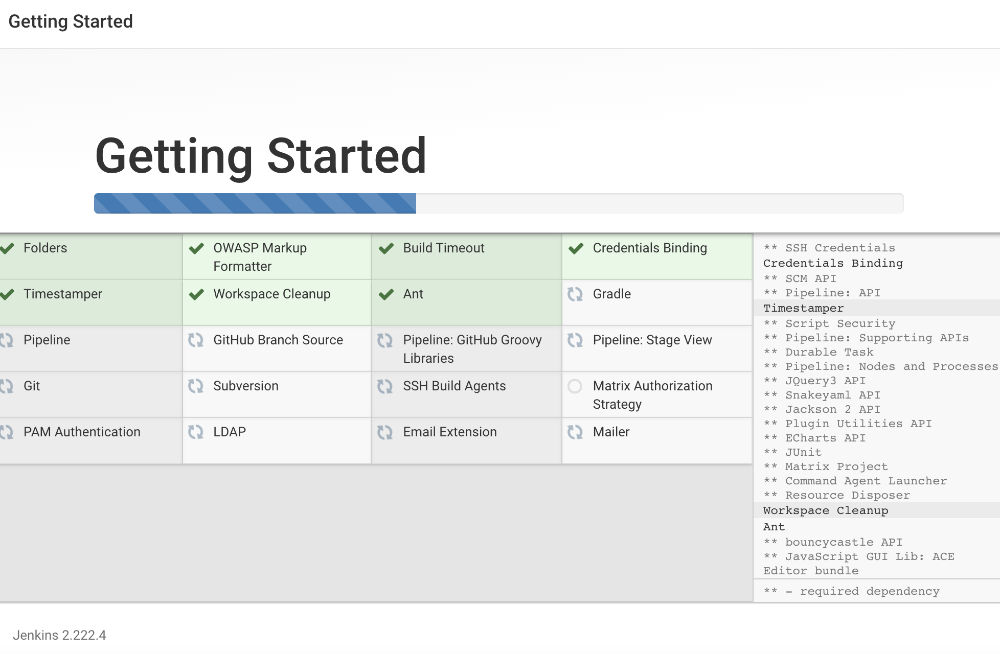
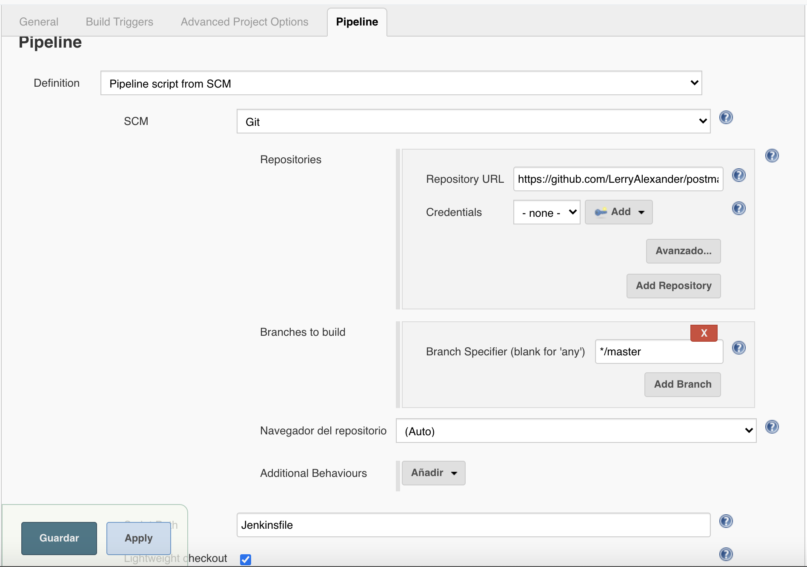

# Postman + Newman API Auotmated Tests running on a Jenkins pipeline
This project is an example of how can be integrated **API automated tests** wita eh **Postman** and **Newman** in a **CI/CD** pipeline with **Jenkins**. For this purpose, we are going to be using a **docker image** which contains jenkins, nodejs and newman already installed.
Besides, we are going to be using a sample server which contains a several of public endpoints to ineract with for building our api automated tests from this site https://petstore.swagger.io/#/

### Prerequisites
  - Docker version 19.03.12

### Getting Started
  - Clone this repository on your local machine:
    - `git clone https://github.com/LerryAlexander/postman_jenkins_api_tests.git`
  - From the root of the repository (`/postman_jenkins_api_tests`) run docker container based on an existing docker image which contains jenkins, nodejs and newman already installed: 
    - `sudo docker run -p 8080:8080 -p 50000:50000 -v ${PWD}:/postman_jenkins_api_tests vdespa/jenkins-nodejs-newman`
  - Install Jenkins on the docker container:
    - Copy admin password from command line and wait until you see message `Jenkins is fully up and running`
    
    - Open Jenkins service at `http://localhost:8080/`
    - Paste the admin password and continue
    - Install suggested plugins:
    
    - Click on **Continue as admin**
    - Click on **Save and Finish**
  - Create a new pipeline:
    - Click on **Create a new job**
    - Enter an item name, for example `Jenkins Newman Tests`, select **Pipeline** option and click on **OK** button
    - In the **Pipeline** section, from **Definition** option select `Pipeline script from SCM`, copy this repository url        (https://github.com/LerryAlexander/postman_jenkins_api_tests.git) and paste it on the **Repository URL** (see image below) and save changes.
    

### Running Pipeline
  
